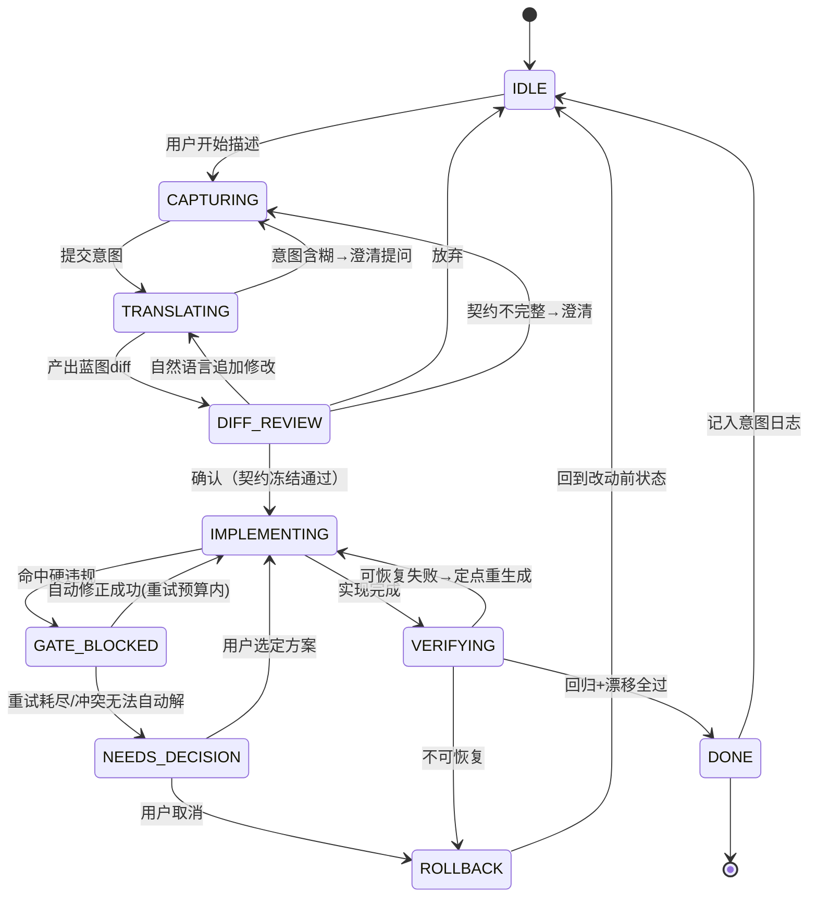
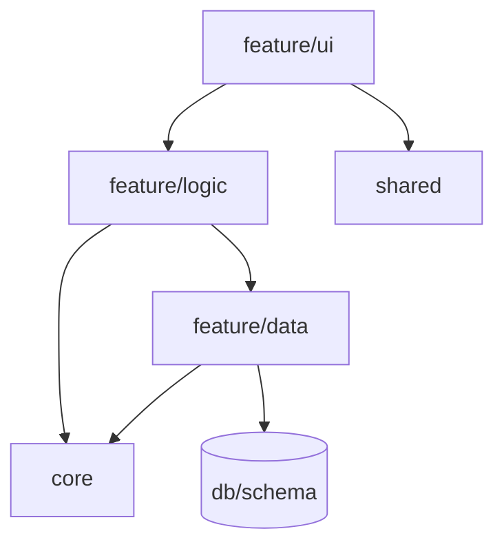

# Keel · 产品需求文档

**Keel（龙骨）**：龙骨是让船在风浪中不倾覆的承重结构，呼应产品内核——让持续成长的应用不腐化。

| 项 | 内容 |
|---|---|
| 负责人 | Alex |
| 产物形态 | 本地执行的桌面端产品，驱动 Claude Code / Codex 生成 Web 全栈应用 |
| 核心定位 | 让非程序员零代码造出可持续成长且不腐化的真实应用 |

**关键决策**

1. 本地执行：桌面应用负责安装与登录，无头引擎负责驱动；架构为日后托管预留接口。
2. 目标产物为 Web 全栈 JS/TS。
3. 纯自然语言驱动，能力地图只读、变更须确认。

---

## 1. 概述与背景

非程序员的 AI 编程已规模化，但存在共性问题：用户能快速起步，项目一旦变大就开始腐化——AI 越改越乱、用户无法读懂代码加以补救，最终卡死或被迫重写、雇人。开发者侧已有成熟的防腐实践（spec-driven development，以及 Claude Code 的 skills / hooks / subagents），但都面向开发者，非程序员无法使用。

Keel 把开发者级的结构纪律产品化，做成非程序员零代码可用的能力。它骑在 Claude Code / Codex 之上，使 LLM 能持续迭代一个不断成长的真实应用而不腐化，且代码始终归用户所有、可随时交接给开发者。

**竞争定位**

- 对 Lovable / Bolt / v0 / Replit：它们擅长起步、却在成长期腐化；Keel 主打持续迭代不腐化。
- 对 Floot / Mocha：它们以闭环锁定用户；Keel 开放代码、不锁定、支持迁出。
- 对 Spec Kit / Kiro / CC-SDD：它们要求会写 spec、读 diff；Keel 把同等结构纪律做成非程序员可用。

---

## 2. 目标与非目标

**目标**

- G1：用户在不接触代码与终端的前提下，造出一个可持续成长的 Web 全栈应用。
- G2：随能力增多，项目保持结构健康；新增第 N 个功能的边际成本不显著上升。
- G3：结构、边界与契约类约束通过不可绕过的确定性门禁强制实现，而非依赖提示或文档。行为正确性按「有无可执行判据（oracle）」分治：**有 oracle 的**行为（可由契约派生单测/属性测试验证者）远期纳入行为门自动把关；**无 oracle 的**（产品意图、交互体验等）由人工批准锚定。当前门禁保证「结构不腐化、契约一致」，尚不保证「功能符合预期」；行为门为 R1 之后的远期项（见 ADR-0009）。
- G4：代码全程开放、随时可导出、可生成开发者交接包。

**非目标**

- 撞墙解套 / 导入已腐化的存量项目。
- 跨工作流（写作、运营等）。
- 多人协作、跨项目看板、可复用资产市场。
- 自建部署与托管基础设施。
- 移动端及非 Web 应用类型。

---

## 3. 目标用户与画像

主用户为想造可持续成长的真实应用（有用户、有数据、持续加功能，而非一次性玩具）的非程序员。

**Persona A · 重来者（v1 主要人群）**

- 用过 Lovable / Bolt 等，亲历过越改越崩，成长意图已被验证。
- 半技术：能安装 Claude Code / Codex（含桌面应用）并完成登录，能读懂能力地图，但不会做架构。
- 选择动机：这次不要再崩，而且代码归我。

**Persona B · 接手的开发者（间接角色）**

- 日后通过交接包承接项目。其上手体验是 G4 的验收对象。

---

## 4. 核心概念与术语

- **应用蓝图（Blueprint）**：唯一真相源。声明式、机器可检的期望态，描述应用应有的样子；代码必须永远服从蓝图。
- **能力地图（Capability Map）**：蓝图的人类可读视图，是非程序员的唯一界面，永远从蓝图渲染，不从代码逆推。
- **漂移（Drift）**：代码与蓝图的偏离，包括破边界、重复实现、孤立未接线代码、契约不符。
- **调和（Reconcile）**：以受影响切片的契约为锚、整片重生成使其收敛回期望态的有界过程，不触发整体重写，也不在既有代码上就地修补。
- **门禁（Gate）**：在每次代码改动处运行检查器、违规即拦截的确定性机制。
- **执行引擎（Engine）**：实际驱动代码改动的底层 agent（Claude Code / Codex），由 Keel 无头驱动。
- **架构原型（Archetype）**：一套捆绑的「默认结构 + 宪法 + 门禁规则集 + 检查器配置」，由意图自动选定，作为项目的初始蓝图。

---

## 5. 范围与关键假设

**范围**：单人 · 单项目 · 绿地起步 · Web 全栈 JS/TS · 本地执行 · 结构不腐化 · 可导出迁走。

**关键假设**：核心机制尚未验证——蓝图能否同时做到机器可检与非程序员可读。这是产品成立的前提，须优先安排最小验证。

---

## 6. 功能需求

### FR-1 项目初始化与上手

**描述**：新建绿地项目，经桌面应用完成安装与登录、经中立协议或 SDK 连接执行引擎，确立初始蓝图与骨架。安装与鉴权交由桌面应用（对新手友好），驱动交由无头引擎（用户不可见）。

**用户故事**：作为重来者，我想下载安装一个应用、点一下登录，就能开始描述我的应用，全程不碰终端、不手抄密钥。

**功能点**

- 检测本地执行引擎（Claude Code / Codex 的桌面应用、CLI 或 ACP adapter）是否就绪。
- 引擎缺失时深链官方图形安装包，给图形化引导而非终端命令。
- 鉴权优先触发应用自带的订阅登录（OAuth）；仅持有 API key 的用户亦兼容，本地存储、最小权限授权。
- 经 ACP 中立协议或 Agent SDK / 无头 CLI 在后台连接引擎，并跑一个冒烟任务校验连通；桌面图形界面仅用于安装与登录，不用于驱动。
- 选择应用意图（自由描述加可选起步模板），由意图自动选定架构原型，生成初始蓝图与最小可运行骨架。
- 显示当前消耗的计划与额度。

**验收标准**

- 未安装引擎时给出图形安装引导，而非终端报错。
- 鉴权可经应用登录完成，用户无需手动粘贴密钥；持有密钥时亦兼容。
- 从连接到生成可运行骨架，用户全程未见代码或终端命令。
- 初始蓝图可在能力地图上完整渲染。

### FR-2 应用蓝图

**描述**：声明式、版本化、机器可检的架构期望态。

**功能点**

- 能力清单。
- 模块与分层（UI、应用逻辑、数据访问、外部集成）及依赖方向规则。
- 数据实体与关系。
- 接口契约（组件 props、API 路由的输入输出形态）。
- 技术不变量（命名与目录约定、每个职责仅一个规范实现等）。
- 每条约束标注其强制方式——门可执行（分层与依赖方向、跨能力边界、接口契约、重复实现、命名与目录）或需人工确认（行为意图、交互体验等缺乏可执行 oracle 的约束）。
- 蓝图版本化，每次变更可追溯。
- 蓝图为分层结构（内置层、项目覆盖层、生成能力层），经确定性编译产出地图视图与门禁配置。

**验收标准**

- 每条标注为「门可执行」的约束都对应一条可被检查器执行的规则，不存在仅写在文档里却声称可强制的结构约束；标注为「需人工确认」的约束在意图捕获处经人工批准锚定。
- 代码与蓝图在结构、边界与契约上的任意偏离都能被 FR-6 检出。

### FR-3 能力地图

**描述**：蓝图的只读可视化，是非程序员的主界面。

**功能点**

- 以「能力—模块—数据—连接」呈现应用形状。
- 叠加健康状态（绿 / 黄 / 红）。
- 支持查看某能力的说明、所属模块、依赖关系，全程通俗表达、不暴露代码。
- 只读；结构变更一律走 FR-4。

**验收标准**

- 地图内容全部来自蓝图，不从代码逆推。
- 用户能据地图回答「我的应用有哪些能力、它们如何连接」。

### FR-4 意图捕获与蓝图 diff

**描述**：把自然语言意图翻译成蓝图变更，确认后才动代码。

**用户故事**：作为用户，当我说「加一个用户能收藏文章的功能」，我想先看到它会怎样改动应用结构，确认无误再让它动手。

**功能点**

- 自然语言输入产出蓝图 diff：新增或修改哪些能力、触及哪些边界、定义什么契约。
- 以「地图 diff + 通俗解释」呈现，并标注将受影响的现有能力。
- 用户可确认、用自然语言追加修改、或拒绝。
- 确认后先冻结本次涉及的接口契约（contract.ts）、数据实体与 API 路由 schema，作为后续实现的只读锚点；冻结本身是一道独立门，契约不完整或不一致则退回澄清。
- 仅在契约冻结通过后进入 FR-5。

**验收标准**

- 任何改变结构的请求都必须先产出蓝图 diff 并获确认，不存在绕过蓝图直接写代码的路径。
- 进入实现前，本次涉及的契约已冻结并通过一致性校验；实现阶段不得修改已冻结契约。
- diff 解释不含代码术语，目标用户可读懂。

### FR-5 受门禁约束的实现执行

**描述**：契约冻结后驱动引擎实现，每次编辑都经过确定性门禁；实现以已冻结契约为只读锚点逐切片进行。

**功能点**

- 经 ACP 权限中介或 Agent SDK hooks，在编辑生命周期点无头驱动引擎，针对已冻结契约逐切片执行实现；实现期间函数签名、目录结构与契约只读。
- 每次文件改动经检查器校验；违反蓝图（破边界、重复实现、契约不符）即拦截，修正后方可继续。
- 在隔离 worktree 内「实现—校验—合并」，为安全回滚提供边界。
- 进度以能力地图上的状态变化呈现，不向用户暴露代码或终端输出。
- 门禁按严重度分级：硬违规阻断，软问题降级为告警，避免 LLM 空转。

**验收标准**

- 存在违反蓝图边界的改动时，门禁能阻断其落地。
- 一次正常的加能力实现中，用户无需看到任何代码或终端命令。

### FR-6 漂移检测与项目健康

**描述**：持续比对代码与蓝图，给出非程序员可懂的健康信号。

**功能点**

- 持续与增量检测漂移并归类（破边界、重复实现、孤立未接线、契约不符）。
- 项目健康红绿灯，配通俗问题清单（如「收藏功能被实现了两遍，建议合并」）。
- 每个问题可一键触发 FR-7 调和。

**验收标准**

- 四类漂移在引入后能被检出并以通俗语言展示。
- 健康状态变化对用户实时可见。

### FR-7 调和

**描述**：把漂移或蓝图变更收敛回期望态。

**功能点**

- 检测到漂移、或用户改了蓝图时，以受影响能力的冻结契约为锚，驱动引擎整片重生成该 features/<capability>/ 切片，使代码重新服从蓝图，而非在既有代码上就地打补丁。
- 重生成以切片为单位、无状态进行：每次仅依据该切片的契约与本地依赖，不积累跨切片漂移。
- 调和过程同样受门禁约束。
- 调和为有界操作；以切片为边界，不触发整体重写。

**验收标准**

- 调和后该项漂移消失，且不引入新的回归。
- 调和以切片重生成而非就地修补完成；重生成的切片仅依赖其契约与本地上下文。

### FR-8 改动影响预览

**描述**：动手前展示影响范围。

**功能点**

- 基于蓝图依赖图，在地图上高亮本次变更将触及的能力与模块。

**验收标准**

- 预览所示影响范围与实际改动范围一致，无明显漏标。

### FR-9 回归守护

**描述**：防止新改动破坏既有能力。

**功能点**

- 随能力增加累积行为检查，每次改动后运行。
- 新改动导致既有能力检查失败时，阻断并以通俗语言解释。

**验收标准**

- 会破坏既有能力的改动会被拦截并解释，而非静默落地。

### FR-10 意图日志与可回滚时间线

**描述**：保留每次变更的原始意图，并提供可回滚的演化时间线。

**功能点**

- 每次变更记录原因，并绑定到对应蓝图 diff。
- 提供非程序员可读的演化时间线；可回滚某次能力变更，无需懂 git。

**验收标准**

- 任一历史变更都能查到其意图与蓝图 diff。
- 回滚后项目回到该点的健康一致状态。

### FR-11 开放代码与一键导出

**描述**：代码真实、干净、归用户所有。

**功能点**

- 生成结构服从蓝图的标准 JS/TS 仓库。
- 蓝图与宪法编译落地为标准、厂商中立的工具配置（dependency-cruiser、eslint、tsconfig、schema 等）并入库，使导出物脱离 Keel 仍能自我强制结构。
- 随时一键导出到用户自有仓库，无专有运行时锁定。

**验收标准**

- 导出物为可独立运行的标准项目，脱离 Keel 亦可被开发者继续开发，其结构约束仍由标准工具配置持续强制。

### FR-12 开发者交接包

**描述**：把日后雇开发者从悬崖变成坡道。

**功能点**

- 一键生成：蓝图转架构文档、意图日志转决策史、边界规则转上手指南。

**验收标准**

- 未参与项目的开发者凭交接包能在合理时间内理解项目结构并安全改动。

### FR-13 执行器抽象

**描述**：将执行引擎抽象为可替换层，以中立协议作为标准接缝，为日后托管预留接口。

**功能点**

- 蓝图、门禁、调和逻辑与具体执行引擎解耦。
- 以 ACP（Agent Client Protocol）作为标准接缝：基于 JSON-RPC over stdio，宿主保留对文件系统、权限、终端的控制权；门禁映射为 ACP 的权限中介加编辑后检查；Claude Code 与 Codex 经 adapter 接入。
- 原生实现回退到 Agent SDK 或无头 CLI，提供更完整的 hooks、subagents、sessions。
- 预留托管执行器接入点。

**验收标准**

- 新增一个执行器实现无需改动蓝图、门禁、地图核心模块。
- 在 ACP 与原生 SDK 两种实现间切换对上层透明。

---

## 7. 关键流程

### 流程 A · 主循环：加一个能力

1. 用户在对话面板用通俗语言描述需求。
2. 系统产出蓝图 diff，在地图上以高亮与差异标注呈现，并给通俗解释与受影响能力。
3. 用户确认、追加修改（回到第 2 步）、或拒绝。
4. 确认后先冻结本次涉及的接口契约与数据 schema，再驱动引擎针对冻结契约逐切片实现；每次编辑经过门禁，违规即自动修正。用户看到的是能力节点从规划中到实现中再到已就绪。
5. 实现完成后运行回归守护与漂移检测，健康灯更新。
6. 记入意图日志。

异常分支：门禁反复硬阻断且无法自动推进时，升级为「需你决策」卡片，用通俗语言说明冲突点并给出选项。

### 流程 B · 新项目上手

1. 新建项目，检测引擎；缺失则图形安装并经应用登录完成鉴权。
2. 描述应用意图或选起步模板，自动选定架构原型。
3. 生成初始蓝图与可运行骨架，能力地图首次渲染。
4. 引导用户加第一个能力，进入流程 A。

### 流程 C · 健康预警与调和

1. 健康灯转黄或红，问题清单出现具体项。
2. 用户点选某项，显示通俗说明与修复按钮。
3. 触发调和，受门禁约束、以切片重生成的方式定点收敛。
4. 修复后回归校验通过，健康灯恢复，记入意图日志。

### 流程 D · 导出与交接

1. 用户在项目设置选择导出代码或生成交接包。
2. 导出标准仓库（含编译落地的标准工具配置），或生成架构文档、决策史、上手指南。

---

## 8. 信息架构与界面结构

- 主界面：能力地图（中心画布）、对话面板（侧栏）、健康指示（顶部）。
- 蓝图 diff 确认：地图上叠加差异加解释面板，提供确认、修改、拒绝。
- 影响预览：地图高亮叠加层。
- 健康详情面板：问题清单与逐项修复入口。
- 历史时间线：意图日志与回滚入口。
- 导出 / 交接面板。
- 上手向导：安装与登录引擎、选意图与原型。

---

## 9. 技术约束与架构

- **执行模型**：本地执行。安装与鉴权经桌面应用（图形安装加订阅登录），驱动经无头引擎——优先 ACP 中立协议（Claude Code / Codex 经 adapter 接入），回退 Agent SDK 或无头 CLI；桌面图形界面不用于驱动，详见附录 C。
- **目标产物栈**：Web 全栈 JS/TS（前端 React / Next 类，后端 Node / serverless 类，关系型数据库）。
- **蓝图**：声明式、版本化的结构描述（能力、模块、边界、数据、契约、不变量），分层组织并经确定性编译，详见附录 B。
- **检查器**：依赖边界（dependency-cruiser 或 eslint 边界规则）、结构与契约（AST 检查，如 ts-morph）、重复实现与孤立代码检测。
- **强制点**：经 ACP 权限中介或引擎 hooks，在编辑生命周期点运行检查器并可阻断。
- **隔离与回滚**：每次能力改动在独立 worktree 内「实现—门禁—合并」，为回滚提供干净边界。
- **计费**：订阅计划下，无头用量与交互用量分属不同的周 token 池；Keel 运行于无头侧，额度对用户可见。

---

## 10. 非功能需求

- **安全**：密钥本地存储；优先订阅登录以减少密钥暴露；最小权限；门禁与执行沙箱化；危险操作（如删库）拦截。本地模式下用户代码与密钥不经云端。
- **性能**：门禁为增量检查，单次编辑校验有延迟预算，不得拖慢加能力循环。
- **可靠与可恢复**：门禁失败不得使项目卡死；提供「需你决策」出口与基于 worktree 的安全回滚。
- **防过度约束**：门禁按严重度分级（硬阻断与软告警），避免把 LLM 逼到空转或绕路。
- **成本可见**：无头用量计入独立 token 池，当前计划与额度对用户透明。
- **可移植**：标准 JS/TS 仓库，宪法编译为标准工具配置，随时导出，无专有锁定。

---

## 11. 成功度量

- **北极星**：新增第 N 个功能的边际成本曲线（turns、tokens、人工干预）随 N 保持平稳。
- **抗腐化（回复力）**：项目健康/漂移随迭代轮次的曲线保持锯齿归零（每轮被调和拉回基线），而非单调累积上升——这是边际成本平稳的内在机制，作为长期腐化的直接观测量。
- **激活**：完成首个「描述—确认—落地」循环的用户比例。
- **留存与深度**：同一项目持续迭代达到目标能力数或周数的比例。
- **健康**：项目维持绿灯的时间占比。
- **毕业**：导出与交接包的使用率。
- **失败信号**：门禁触发「需你决策」或空转的发生率。

---

## 12. 风险与开放问题

**风险**

- **R1 核心假设（未验证）**：蓝图能否同时满足机器可检与非程序员可读。这是产品成立的前提，须优先安排最小验证。
- **R2 过度约束**：门禁过硬会导致 LLM 空转或绕路。以严重度分级缓解，需实测。
- **R3 平台风险**：Claude Code / Codex 可能自推非程序员模式形成挤压。以执行器抽象、强意见治理、模型中立作为对冲。
- **R4 早期用户门槛**：纯小白未必能自行安装本地引擎。桌面应用的图形安装与订阅登录降低门槛但未完全消除；v1 锁定半技术的重来者，纯小白留待托管阶段。
- **R5 复杂度天花板**：蓝图表达力能否覆盖目标用户真实项目的复杂度，需验证。

**开放问题**

- 架构原型集合的范围：上线几个、如何由意图映射。
- 项目覆盖层的白名单边界如何界定。
- 门禁严重度分级的判定规则。
- 无头 token 池下的定价模型。
- 多大或多复杂的项目算超出当前天花板，产品如何优雅告知。
- 正式产品命名。

---

## 13. 路线图

本地单项目绿地不腐化可迁走，到托管执行触达纯小白，到撞墙解套导入存量项目，再到跨工作流与多人协作。

---

# 附录 A · 主循环状态机与线框

对应流程 A 及 FR-4、FR-5、FR-6、FR-8、FR-9、FR-10。

## A.1 状态机



## A.2 状态说明

| 状态 | 含义 | 用户可见 |
|---|---|---|
| IDLE | 待命，主界面能力地图 | 完整地图加健康灯 |
| CAPTURING | 用户在对话面板描述需求 | 输入框、历史对话 |
| TRANSLATING | 自然语言转蓝图 diff 中 | 加载态 |
| DIFF_REVIEW | 展示蓝图 diff，等待决策 | 地图差异叠加加解释加受影响能力 |
| IMPLEMENTING | 受门禁约束驱动引擎实现 | 能力节点实现中，进度以通俗语言呈现 |
| GATE_BLOCKED | 命中硬违规，自动修正中 | 仍显实现中，内部重试，对用户透明 |
| NEEDS_DECISION | 冲突需用户拍板 | 决策卡片，含冲突点与 2–3 选项 |
| VERIFYING | 运行回归与漂移检测 | 能力节点校验中 |
| DONE | 能力就绪 | 节点已就绪，健康灯更新，toast |
| ROLLBACK | 回滚到改动前 | 地图复原，提示已回滚 |

## A.3 转移与守卫

| 来源 | 事件 | 守卫 / 条件 | 去向 |
|---|---|---|---|
| TRANSLATING | 翻译完成 | 意图可解析 | DIFF_REVIEW |
| TRANSLATING | 翻译完成 | 意图含糊或多解 | CAPTURING（带澄清问题）|
| DIFF_REVIEW | 确认 | 涉及契约冻结并通过一致性校验 | IMPLEMENTING |
| DIFF_REVIEW | 确认 | 契约不完整或不一致 | CAPTURING（带澄清问题）|
| IMPLEMENTING | 编辑落地 | 检查器通过（含软告警） | 继续 IMPLEMENTING |
| IMPLEMENTING | 编辑被拒 | 硬违规 | GATE_BLOCKED |
| GATE_BLOCKED | 自动修正 | 重试次数小于预算且可自动解 | IMPLEMENTING |
| GATE_BLOCKED | 升级 | 重试耗尽或需架构取舍 | NEEDS_DECISION |
| VERIFYING | 校验失败 | 可定点重生成 | IMPLEMENTING |
| VERIFYING | 校验失败 | 不可恢复 | ROLLBACK |

## A.4 严重度分级对状态流的影响

- 硬违规（破依赖边界、重复实现、契约不符）触发 GATE_BLOCKED，必须解决才能前进。
- 软问题（命名不规范、轻微冗余等）不阻断，直接流过 VERIFYING，记入项目健康（黄），稍后在流程 C 调和。
- NEEDS_DECISION 是最后的安全阀，确保不静默卡死。

## A.5 线框

**主界面（IDLE / CAPTURING）**

```
┌─────────────────────────────────────────────┬───────────────┐
│  健康灯 ●绿  | 项目名      [历史] [导出/交接] │  对话面板      │
├─────────────────────────────────────────────┤               │
│                                             │  [过往对话]    │
│        能 力 地 图（中心画布）               │               │
│   [登录]──[文章列表]──[文章详情]            │               │
│         └──[评论]                           │               │
│                                             │  ┌──────────┐ │
│   （节点=能力，连线=依赖，颜色=健康）        │  │描述你想加 │ │
│                                             │  │的功能… ▢ │ │
│                                             │  └──────────┘ │
└─────────────────────────────────────────────┴───────────────┘
```

**蓝图 diff 确认（DIFF_REVIEW）**

```
┌─────────────────────────────────────────────┬───────────────┐
│  能力地图（差异叠加）                        │  这次改动      │
│   [登录] [文章列表] [文章详情]               │  ＋新增能力：  │
│         ＋[收藏] (高亮·虚线)                 │   "收藏文章"   │
│         [收藏]──依赖──[文章详情] [登录]      │               │
│                                             │  会碰到：      │
│                                             │  · 文章详情(加按钮)│
│                                             │  · 登录(需登录) │
│                                             │  · 新增"收藏"数据│
│                                             │  ────────────  │
│                                             │ [确认] [改] [放弃]│
└─────────────────────────────────────────────┴───────────────┘
```

解释区全程通俗表达，不含代码术语；「改」即回到对话追加修改。

**实现中（IMPLEMENTING / GATE_BLOCKED）**

能力节点显示实现中，可展开查看进展，看到通俗步骤（如「正在把收藏按钮接到文章详情」）。GATE_BLOCKED 对用户透明，内部自动修正。

**需你决策（NEEDS_DECISION）**

```
┌───────────────────────────────────────────┐
│  ⚠ 需要你拍个板                            │
│  "收藏"既可以挂在每篇文章上，也可以做成     │
│  一个独立的"我的收藏"页。两种结构不一样。   │
│   ○ 每篇文章上加收藏（更简单）             │
│   ○ 独立"我的收藏"页（更完整）             │
│                              [选这个]      │
└───────────────────────────────────────────┘
```

**完成（DONE）**

节点变已就绪，健康灯刷新，toast 提示「收藏功能已加好」，自动写入意图日志。

## A.6 状态与可用操作

| 状态 | 用户能做 | 系统在做 |
|---|---|---|
| IDLE | 描述新需求、看地图、看历史、导出 | 待命 |
| DIFF_REVIEW | 确认、修改、放弃 | 等待 |
| IMPLEMENTING | 看进展、可中止 | 受门禁实现 |
| NEEDS_DECISION | 选方案、取消 | 等待 |
| DONE | 进入下一轮 | 记日志、刷新健康 |

---

# 附录 B · 默认架构模板与宪法（Web 全栈 JS/TS）

把「能力（蓝图）= 代码切片 = 地图节点」三者对齐，从而既可机器强制、又可向非程序员渲染。

## B.1 设计原则

- **特性切片优先**：每个能力是一个自包含切片，对应代码里一处、地图上一个节点，三者一一对应。
- **强意见**：默认给出一套完整结构与规则，用户不需要懂、也不需要选。
- **凡约束皆可机器检**：每条宪法规则都映射到一种确定性检查，不存在仅写在文档里的规则。

## B.2 默认目录结构

```
src/
├─ features/                 # 每个能力一个切片
│  └─ <capability>/
│     ├─ ui/                 # 该能力的界面
│     ├─ logic/              # 该能力的业务逻辑
│     ├─ data/               # 该能力的数据访问
│     └─ contract.ts         # 对外接口契约（类型/schema）
├─ shared/                   # 跨能力复用的纯展示/工具
├─ core/                     # 横切设施：auth、db 客户端、config（唯一封装）
└─ app/                      # 路由与装配
db/
└─ schema + migrations       # 数据模型唯一真相源
```

## B.3 依赖方向规则



规则（违反即硬违规）：

1. feature 之间不得直接 import；跨能力交互只能经 core 或对方 contract.ts。
2. ui 到 logic 到 data 单向，不得反向。
3. 任何层访问数据库或外部服务必须经 core 的统一封装，禁止散落直连。
4. shared 不得依赖任何 feature。

## B.4 一个职责一个规范实现

宪法为每个横切职责声明唯一规范家：

| 职责 | 规范家 | 重复出现即违规 |
|---|---|---|
| 鉴权 | core/auth | ✔ |
| 数据库访问 | core/db | ✔ |
| 表单处理 | shared/form | ✔ |
| API 调用封装 | core/api | ✔ |
| 输入校验 | 统一校验库（如 schema） | ✔ |

## B.5 接口契约与数据模型

- 每个 feature 的 contract.ts 声明其对外类型与 schema；跨能力只认契约。
- 组件需声明 props 类型；API 路由需声明输入与输出 schema。
- 数据模型以 db/schema 为唯一真相源，变更走迁移，禁止散落的临时改 schema。

## B.6 宪法 · 技术不变量

开局锁定、整生命周期不漂移：前端框架、后端形态、数据库与访问方式、校验库、目录与命名约定、上述依赖规则。新能力只能在其内生长。

## B.7 规则与强制机制与严重度

| 宪法规则 | 强制机制 | 严重度 |
|---|---|---|
| feature 间不互相 import | 依赖边界检查（dependency-cruiser / eslint 边界规则） | 硬 |
| 层间单向依赖 | 同上 | 硬 |
| 数据与外部访问必经 core | 依赖规则加 import 白名单 | 硬 |
| 一个职责一个规范实现 | 重复实现与相似度检测（AST，如 ts-morph） | 硬 |
| 契约一致 | 类型检查加 schema 校验 | 硬 |
| 命名与目录约定 | lint 规则 | 软 |
| 无孤立未接线代码 | 可达性与引用分析 | 按场景定软或硬 |

强制统一通过 ACP 权限中介或引擎 hooks 在编辑生命周期点运行；硬违规阻断，软问题入项目健康。

## B.8 蓝图与代码映射

蓝图里一个 capability 对应代码里一个 features/<capability>/ 切片，对应地图上一个节点；其声明的依赖既渲染为地图连线、又编译为依赖规则。

以能力「收藏文章」为例：

- 蓝图条目：capability favorite，依赖 article-detail 与 auth，新增数据实体 Favorite(userId, articleId)，契约 favorite/contract.ts。
- 代码落点：features/favorite 下的 ui、logic、data、contract.ts；经 core/auth 判登录、core/db 存取；不直接 import features/article-detail，而是通过其契约挂按钮。
- 地图呈现：新增收藏节点，连到文章详情与登录。
- 门禁：若在 favorite 内直连数据库则硬违规阻断；若另写一套鉴权则按重复实现阻断。
- 调和：favorite 切片出现漂移、或其蓝图条目变更时，以 favorite/contract.ts 为锚整片重生成该切片，而非就地修补。

## B.9 默认架构原型集

每个原型是「默认结构 + 宪法 + 门禁规则集 + 检查器配置」的捆绑，由意图描述自动选中，用户不需理解或挑选架构。

| 原型 | 模式 | 适配意图 |
|---|---|---|
| 特性切片 / 模块化单体（默认，即 B.2） | Feature-sliced / Modular monolith | 通用 |
| 分层 | Layered / N-tier | 带登录的管理后台 |
| 六边形 | Ports & Adapters | 集成多的应用，contract.ts 与 core 映射 port 与 adapter |
| 内容站加数据层 | Headless content | 带数据库的内容站 |

原则：

- 原型差异以门禁规则集表达，而非只换目录；选原型即选初始宪法。
- v1 仅上 2–3 个，且不让用户选架构，由意图描述自动映射。
- 原型是起点蓝图、不是牢笼；能力在其内生长，原型锁定的是 B.6 的耐久不变量。

## B.10 扩展性：内置与定制的分层与编译

内置与用户个性化分层，并以确定性编译统一整合，参照配置继承（eslint / tsconfig 的 extends）、约定优于配置、设计 token 层叠，以及策略即代码（写高层策略、编译成具体检查）。

**三层与优先级**

1. **平台内置层**：原型默认结构、不可谈判的不变量、检查器实现、默认严重度。由 Keel 版本化下发，密封，用户改不动硬核。
2. **项目覆盖层**：白名单化、声明式的可调旋钮集（命名约定、校验库选型、额外放行的依赖、有界的严重度微调），受约束、非自由格式。
3. **生成能力层**：用户的能力、实体、契约、意图日志，由自然语言生成，归用户。

**编译与合并**

```
effective_blueprint = merge(内置默认, 项目覆盖, 生成能力)
```

- 优先级显式；存在一组密封不变量，覆盖层不可触及，试图覆盖即编译期拒绝。
- 编译产出两类结果：能力地图视图，以及具体强制配置（dependency-cruiser 规则、ts-morph 检查、eslint / tsconfig、db schema）。编译即「声明式蓝图转机器可执行门禁」。

**放置与可迁出**

- 内置规则在 Keel 内以抽象形式编写，但编译落地为标准、厂商中立的工具配置并提交进用户仓库，使导出项目即使脱离 Keel 仍自我强制结构。意见被物化为标准配置，而非专有运行时。
- 仓库内真相源为一个声明式项目蓝图文件加编译出的标准配置，二者均入库，保证仓库自足。

**版本升级**

- 分层加确定性合并使 Keel 升级原型默认时不冲掉用户覆盖，遵循框架升级与迁移语义。

## B.11 强制与可读性现状

- 强制一侧基础扎实：依赖边界、契约、重复检测均为成熟可实现的检查。
- 可读一侧仍是最大未知：依赖规则、契约这类结构约束能否被非程序员从地图真正理解尚待验证。特性切片对齐解决了「能力对应节点」，但未解决「约束对应通俗表达」，须尽早以真实用户测试地图可读性。

---

# 附录 C · 执行器接入架构

对应 FR-1、FR-13、第 9 节。核心原则是把安装与鉴权同驱动分层：桌面应用对新手友好，负责前者；驱动走无头引擎，桌面图形界面不暴露稳定无头执行，不用于驱动。

## C.1 三层接入

| 层 | 职责 | 实现 | 对用户 |
|---|---|---|---|
| 安装 | 让引擎就位 | 检测；缺失时深链官方图形安装包 | 图形安装，不见终端 |
| 鉴权 | 取得可用额度 | 优先应用自带订阅登录，兼容本地密钥 | 点一下登录，不抄密钥 |
| 驱动 | 实际改代码 | 无头：ACP 中立协议、Agent SDK 或无头 CLI | 完全不可见 |

## C.2 驱动层选型

- **首选 ACP**：基于 JSON-RPC over stdio 的中立协议，Claude Code 与 Codex 均经 adapter 接入。宿主保留对文件系统、权限、终端的控制权，与门禁模型同构（门禁即权限中介加编辑后检查），并为执行器抽象提供标准接缝。
- **回退 Agent SDK 或无头 CLI**：hooks 生命周期、subagents、sessions 更完整，用于需要更细粒度钩子或 ACP 能力不足时。
- **不采用桌面图形自动化**：不稳定、无头无保证，桌面应用仅用于安装与登录。

## C.3 门禁与隔离

- 在编辑生命周期点经 ACP 权限中介或引擎 hooks 运行检查器，硬违规阻断。
- 每次能力改动在独立 worktree 内「实现—门禁—校验—合并」，为回滚提供干净边界。

## C.4 计费与配额

- 订阅计划下，无头用量与交互用量分属不同的周 token 池；Keel 运行于无头侧。
- 上手与设置界面显示当前消耗的计划与额度。
