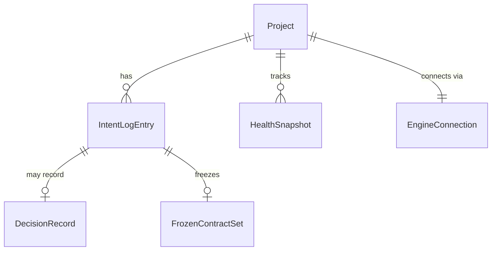

# Architecture 分卷 — 数据模型: Keel

[NAV]
- §4 数据模型 → §4.1 实体关系, E-001..E-006
[/NAV]

## 4. 数据模型

> **范围**: 本卷只建模 **Keel 本体的元数据**（项目/意图日志/决策/冻结契约/健康缓存/引擎连接）。
> - 应用结构真相源（units/ports/relations/entities/constraints/...）是**蓝图图 IR**，以 Git 可 diff 的 YAML/JSON 持久化（M-001），不在关系表里重复建模。
> - **目标应用的领域实体**（如博客的 User/Article/Comment）是各项目蓝图里的 `Entity` 原语，由生成代码落到目标应用自有 Postgres，亦不在此。
>
> **持久化选型**: Keel 元数据本地存储，SQLite 候选（local-first，Web 壳 + 本地引擎服务）；意图日志条目与 Git commit 一一对应（[ASSUMPTION] F-013 备注，待 dev 阶段确认 commit↔entry 映射粒度）。

### 4.1 实体关系

### E-001: Project
| 字段 | 类型 | 约束 | 说明 |
|------|------|------|------|
| id | string | PK | 项目标识 |
| name | string | required | 项目名（= 蓝图 meta.app_name） |
| archetype | string | required | 架构原型，v1 固定 `modular-monolith` |
| stack | string | required | 锁定栈标识，如 `web-fullstack-js-ts` |
| blueprintPath | string | required | 蓝图文件路径（Git 内） |
| repoPath | string | required | 目标应用代码仓路径 |
| createdAt | datetime | required | 创建时间 |

### E-002: IntentLogEntry
| 字段 | 类型 | 约束 | 说明 |
|------|------|------|------|
| id | string | PK | 条目标识 |
| projectId | string | FK→Project | 所属项目 |
| intentText | string | required | 原始意图文本（F-013 AC-001） |
| blueprintDiff | json | required | 对应蓝图 diff |
| plainSummary | string | required | 自然语言摘要（时间线展示，F-013 AC-002） |
| gitRef | string | nullable | 关联 git commit（[ASSUMPTION]） |
| timestamp | datetime | required | 操作时间戳 |

### E-003: DecisionRecord
| 字段 | 类型 | 约束 | 说明 |
|------|------|------|------|
| id | string | PK | 决策记录标识 |
| entryId | string | FK→IntentLogEntry | 关联意图条目 |
| conflict | string | required | 冲突点通俗描述 |
| options | json | required | 提供的选项（接受偏差更新蓝图 / 拒绝并重做） |
| resolution | string | required | 用户所选项（F-010 AC-006 留痕） |

### E-004: FrozenContractSet
| 字段 | 类型 | 约束 | 说明 |
|------|------|------|------|
| id | string | PK | 冻结契约集合标识 |
| entryId | string | FK→IntentLogEntry | 关联本次意图 |
| ports | json | required | 冻结的 Port 签名快照（只读锚点，F-009 AC-006） |
| entitySchemas | json | required | 冻结的 Entity schema 快照 |
| frozenAt | datetime | required | 冻结时间 |

### E-005: HealthSnapshot
| 字段 | 类型 | 约束 | 说明 |
|------|------|------|------|
| id | string | PK | 快照标识 |
| projectId | string | FK→Project | 所属项目 |
| nodeId | string | required | 蓝图节点 id |
| health | enum | green/amber/red | 健康状态（F-004 AC-003，地图叠加） |
| issues | json | nullable | 关联的漂移项/软告警（通俗描述） |
| updatedAt | datetime | required | 更新时间 |
注: 派生缓存——可由蓝图 + 最近门禁/漂移结果重算，持久化仅为地图快速渲染（≤1s）。

### E-006: EngineConnection
| 字段 | 类型 | 约束 | 说明 |
|------|------|------|------|
| id | string | PK | 连接标识 |
| projectId | string | FK→Project | 所属项目 |
| kind | enum | acp/sdk/cli | 接入方式（F-018） |
| authRef | string | required | 鉴权凭据引用（指向系统密钥库，**不存明文**，§3.2 / F-015 AC-004） |
| status | enum | connected/disconnected/unauthenticated | 连接状态 |
