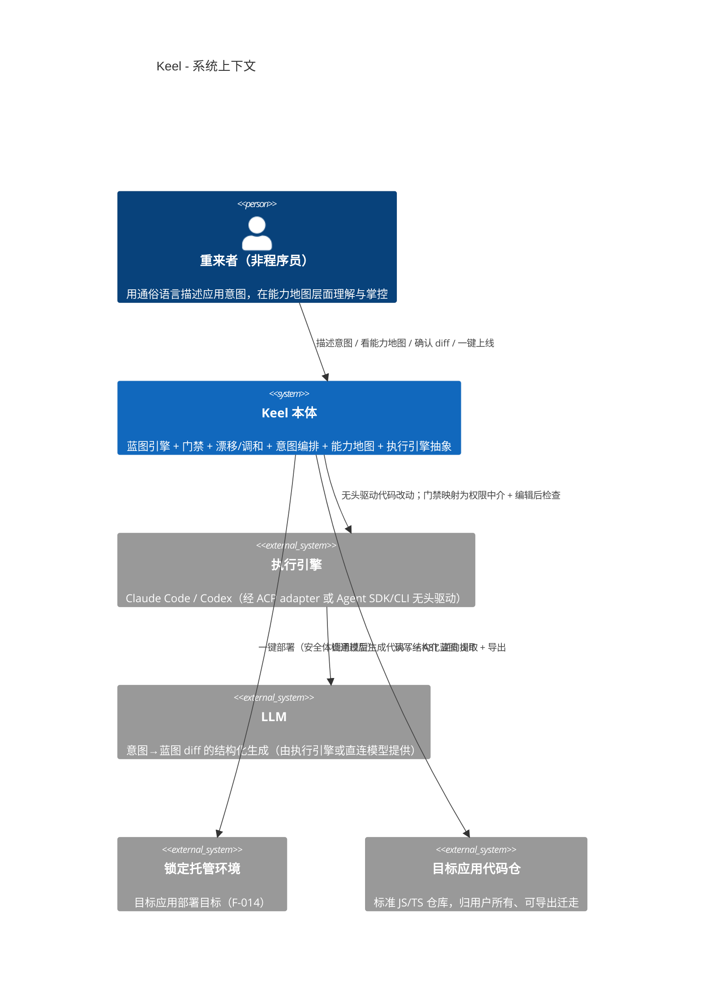

# Architecture: Keel（龙骨）

[NAV]
- §1 架构概览 → §1.1 项目类型, §1.2 架构风格, §1.3 系统上下文图, §1.4 技术栈
- §2 模块划分 → M-001..M-015 总览（详见分卷 arch-keel-modules）
- §3 接口契约 → API-001..API-NNN（详见分卷 arch-keel-api）
- §4 数据模型 → E-001..E-NNN（详见分卷 arch-keel-data）
- §5 非功能架构 → §5.1 性能, §5.2 安全, §5.3 错误处理, §5.4 配置管理
- §6 目录结构
- §7 开发约定 → §7.1 命名, §7.2 代码风格, §7.3 Git约定
[/NAV]

## 1. 架构概览

### 1.1 项目类型
- **类型**: fullstack（Keel 本体为 Web 全栈应用：前端工作区 + 本地引擎服务；v1 桌面外壳延后，保留外壳可替换接缝）

Keel 是一个「应用构建器」，其本身的架构与它**生成的目标应用**架构是两件事：
- **Keel 本体**（本文档对象）：TypeScript 单栈，承载蓝图引擎/门禁/漂移/调和/意图编排/可视化/执行引擎抽象。
- **目标应用**（Keel 生成物）：锁定栈 Next.js 16 + PostgreSQL + Better Auth + Drizzle，结构服从 `modular-monolith` 原型（见 `docs/blueprint.example.yaml`）。

### 1.2 架构风格
- **Keel 本体：图驱动的确定性管线（Graph-IR pipeline）+ 模块化单体**。核心是「蓝图图 IR 作唯一真相源 → 确定性检查器门禁 → 引擎在图约束下生成代码」的单向数据流。Keel 自身亦采用模块化单体（与它倡导的 `modular-monolith` 原型同构，dogfood 一致性）。
- **选型理由**：①核心价值主张「蓝图作真相源 + 确定性门禁防漂移」天然是一条「IR → 变换规则 → 可验证输出」的确定性管线（PRD §4.4 三元式）；②单人·单项目·锁定栈（PRD §4.1）规模下，分布式/微服务是过度设计（架构复杂度匹配规模）；③Keel 本体保持模块化单体，使其自身也能被自己的门禁约束 dogfood。
- **拒绝的备选**：微服务全家桶（无多团队/多部署单元需求，违背规模匹配原则）；纯文档驱动（PRD 明确要求「可执行、可验证」的图 IR，而非会过期的文档）。
- **调研依据**：`research-arch-tech-eval-stack`（技术栈核验）；PRD §4.4 技术报告三元式；ADR-0003（单一默认原型）、ADR-0007（typed-rule schema）、ADR-0008（R-IR 追溯）、ADR-0009（行为门远期）。

### 1.3 系统上下文图


### 1.4 技术栈
| 层次 | 技术 | 版本 | 生命周期 | 选型理由 | 调研来源 |
|------|------|------|----------|----------|----------|
| Keel 引擎/CLI | TypeScript (Node) | TS 5.x / Node 20+ | 当前 LTS | 与目标栈同语言；门禁工具链原生 TS；导出物自带同款工具 | research-arch-tech-eval-stack §3 |
| Keel 工作区前端 | React + Vite（Web 壳） | React 19.x | 稳定 | 三面工作区（对话/地图/预览）；复用现有静态原型演进；外壳后续可换 Tauri | tech-eval §4 |
| 能力地图渲染 | 图可视化库（React Flow 候选） | 待 ui-spec 细化 | — | 节点/边/健康叠加/层级聚合；只读投影。[ASSUMPTION] 待 ui-spec 最终选型：须核验 React Flow v12 bundle size 对 ≤2s 加载（F-008 AC-005）的影响，备选 D3 自绘（体积小但开发成本高） | F-006 |
| 蓝图校验 | JSON Schema (Ajv) Draft 2020-12 | — | 稳定 | `blueprint.schema.json` 0.3-draft 直接驱动；形态校验 | F-001 |
| 门禁·依赖/分层/封装 | dependency-cruiser | 17.4.x | 活跃 | forbid_relation/direction/via_port/access_only_via/no_outbound_except | tech-eval §3 |
| 门禁·重复实现/AST | ts-morph | 当前 | 活跃 | single_canonical 扫描；F-002 AST 逆向提取 | tech-eval §3 |
| 门禁·编译 | tsc | 随 TS | 稳定 | 编译门（F-003 AC-001） | tech-eval §3 |
| 门禁·孤岛 | madge | 当前 | 维护中 | no_orphan 可达性 | tech-eval §3 |
| 执行引擎接缝 | ACP (JSON-RPC/stdio) | 协议 v1 | 稳定 | Claude Code/Codex 经 adapter；权限中介映射门禁 | tech-eval §2 |
| 执行引擎回退 | Agent SDK / 无头 CLI | 当前 | 稳定 | 更完整 hooks/subagents/sessions（F-018 AC-003） | tech-eval §2 |
| 目标应用·框架 | Next.js (App Router) | 16.2.x | 稳定 | 全栈一体；Server Actions 契合受控生成 | tech-eval §1 |
| 目标应用·数据库 | PostgreSQL | 成熟 | LTS | 关系型真相源；可自托管/导出 | tech-eval §1 |
| 目标应用·认证 | Better Auth | 活跃 | 稳定 | 开源/TS 原生；认证表落项目自有库；导出零外部依赖 | tech-eval §1.1 |
| 目标应用·ORM | Drizzle | 活跃 | 稳定 | TS 原生 schema 即代码；迁移可导出 | tech-eval §1 |

## 2. 模块划分

> 详细职责/接口/依赖见分卷 [arch-keel-modules](arch-keel-modules.md)。每个 F-{NNN} 至少被一个 M-{NNN} 覆盖。

| 模块 | 名称 | 职责一句话 | 映射功能 |
|------|------|-----------|----------|
| M-001 | 蓝图引擎 Blueprint Engine | Graph IR 双层模型 + schema 校验 + Git 可 diff 持久化 | F-001 |
| M-002 | 门禁引擎 Gate Engine | rule.type→检查器编排，结构化 JSON 错误，hard/soft 分层，escape hatch 豁免 | F-003, F-004, F-017 |
| M-003 | 漂移检测器 Drift Detector | ts-morph AST 逆向提取 + 与蓝图来源无关对账（四类漂移） | F-002 |
| M-004 | 调和引擎 Reconcile Engine | 以冻结契约为锚，按切片整片重生成，受门禁约束，内容保护 | F-011 |
| M-005 | 意图编排器 Intent Orchestrator | NL→蓝图 diff（LLM 结构化）+ 契约冻结 + blast radius | F-009, F-007 |
| M-006 | 实现执行器 Implementation Executor | DAG 拓扑序逐切片实现，隔离 worktree，受门禁，进度状态机 | F-010 |
| M-007 | 自愈代理层 Auto-Repair Layer | 消费门禁结构化错误静默自愈，重试上限，业务冲突上浮 | F-005 |
| M-008 | 执行引擎抽象层 Engine Abstraction | ACP adapter + Agent SDK/CLI 回退 + 工具面（MCP/hooks/CLI） | F-018, F-012 |
| M-009 | 能力地图渲染器 Capability Map | plain_* 投影 + 健康叠加 + 只读 + 层级聚合/焦点子图 | F-006 |
| M-010 | 应用预览 App Preview | 目标应用实时运行预览面，门禁通过后自动刷新，状态降级 | F-008 |
| M-011 | 意图日志与时光机 Intent Log & Time Machine | 意图条目记录 + 自然语言时间线 + 一键回滚 + 通道外改动提示 | F-013 |
| M-012 | 上线与安全体检 Deploy & Security Audit | 一键上线 + 认证/数据权限/密钥三类红绿灯检查 | F-014 |
| M-013 | 导出与交接 Export & Handoff | 标准 JS/TS 仓库导出（含工具配置）+ 开发者交接包 | F-015, F-016 |
| M-014 | 项目初始化 Project Init | 引擎检测/鉴权/初始蓝图与骨架生成/原型自动选定 | F-012 |
| M-015 | 工作区外壳 Workspace Shell | 三面工作区（对话/地图/预览）Web 壳，外壳可替换接缝 | F-008 |

**核心数据流（确定性管线）**：M-015 工作区 → M-005 意图编排（NL→diff，契约冻结）→ M-001 蓝图引擎（图 IR 更新）→ M-006 实现执行（DAG 逐切片）→ M-002 门禁（每次改动校验，硬违规拦截）→ M-007 自愈（消费结构化错误）→ M-003 漂移检测（落地后对账）→ M-009 地图（健康状态投影）→ M-011 意图日志（留痕）。M-008 是 M-006/M-007 触达执行引擎的统一接缝。

## 3. 接口契约

> 接口数量 > 10，完整契约（API-001..API-016）见分卷 [arch-keel-api](arch-keel-api.md)（volume_delegation）。本卷仅保留索引：
>
> - 蓝图/门禁/漂移/调和核心接口：API-001（蓝图读写）、API-002（门禁结构化结果，F-003 AC-006）、API-003（漂移）、API-004（调和）
> - 构建主循环接口：API-005（意图→diff）、API-006（契约冻结）、API-007（实现执行）、API-008（自愈）
> - 执行引擎与工具面：API-009（引擎抽象）、API-010（MCP/hooks/CLI 工具面，F-018 AC-006）
> - 可视化/生命周期：API-011（地图视图）、API-012（预览）、API-013（意图日志/时光机）、API-014（上线/安全体检）、API-015（导出/交接）、API-016（初始化）

## 4. 数据模型

> 完整实体定义（E-001..E-006）见分卷 [arch-keel-data](arch-keel-data.md)（volume_delegation）。本卷仅说明范围与索引：
>
> - **本节只建模 Keel 本体元数据**：E-001 Project、E-002 IntentLogEntry、E-003 DecisionRecord、E-004 FrozenContractSet、E-005 HealthSnapshot、E-006 EngineConnection。
> - 应用结构真相源是蓝图图 IR（YAML + Git，M-001），不在关系表重复；目标应用领域实体（User/Article/...）是各项目蓝图的 `Entity` 原语，落目标应用自有 Postgres。

## 5. 非功能架构

### 5.1 性能方案
- **门禁 ≤5s（F-003 AC-005）/ 漂移增量 ≤3s（F-002 AC-005）**：检查器按改动文件集**增量**运行（dependency-cruiser/ts-morph 仅扫受影响切片 + 一跳依赖），全量扫描仅在初始化/调和时；检查器并行编排（独立 rule 互不依赖），结果聚合。**≤3s 仅约束从系统开始执行检测到完成报告的时长；通道外改动从发生到被感知的发现延迟不计入（F-002 AC-005），由 M-003 ChangeWatcher 的发现时机选型决定（[ASSUMPTION]）。**
- **地图渲染 ≤1s / 工作区加载 ≤2s（F-006/F-008）**：地图只渲染 `surfaces_on_map=true` 节点（≤20）；层级聚合默认折叠；图数据由蓝图 IR 投影缓存，蓝图未变不重算。
- **蓝图 diff ≤10s（F-009 AC-008）**：单次意图单次 LLM 结构化生成调用，注入最小上下文（选中节点 + 一跳邻域），不注入全图。
- **自愈循环 ≤30s（F-005 AC-005）**：超阈值转可见进度或「需你决策」卡片，不无反馈长等待。

### 5.2 安全方案
- **凭据**（F-012/§3.2）：执行引擎 API Key/OAuth Token 本地存储，最小权限，不上传 Keel 服务端；Web 壳阶段经本地引擎服务持有，桌面阶段迁系统密钥库。
- **Web 壳 ↔ 本地引擎服务通信约定**：localhost HTTP（仅本机访问，免 TLS）+ Origin 白名单（仅允许本 Web 壳来源，防 CSRF）；凭据明文**不经前端传输**，浏览器仅持 session token / 工作区状态，所有凭据操作经本地引擎服务代理（E-006 `authRef` 仅在引擎服务侧指向系统密钥库）。[ASSUMPTION] 具体鉴权方案待 dev-plan 设计。
- **门禁即安全闸**：`Constraint.severity: hard`（含密钥隔离/权限边界）不受 escape hatch 豁免（F-017 AC-002）。
- **上线安全体检（F-014）三类检查器**（细化主卷 §3.2 最小基线）：①认证配置——扫描受保护路由是否经 Better Auth 中间件，检出 fail-open（dependency-cruiser 访问白名单 + 自定义 lint）；②数据权限——扫描数据访问是否带 owner/租户校验，检出越权路径；③密钥泄露——源码/配置/导出物凭据与内部地址扫描（secret-scan），命中数须为 0。三类映射为可在导出物上独立运行的检查器。

### 5.3 错误处理
- **结构化门禁错误（F-003 AC-006）**：检查器统一输出机器可解析 JSON（`{ rule_id, severity, locations[], message, suggested_fix? }`），供 M-007 自愈与执行引擎读取重试。GateReport 分两段（F-004 AC-001）：`structural`（本次结构门 F-003）与 `regressionReport`（回归守护 F-004 跨能力检出的破坏），M-009 据此区分两类 red 状态并带说明（F-004 AC-003）。
- **重试上限统一在 M-007**（F-005 AC-004）：同一错误 ≤3 次（默认值，可配），达上限升级「需你决策」卡片（F-010 AC-006），不无限重试、不静默放弃。
- **实现隔离（F-010 AC-004）**：单切片实现在隔离 worktree 内「实现—校验—合并」，失败/中止回滚到改动前完整可用状态，不留半成品。
- **降级显式化**：blast radius 依赖图有环/信息缺失时降级并显式提示「影响范围可能不完整」（F-007 AC-003），不在降级态宣称零漏标。

### 5.4 配置管理
- **蓝图为应用结构真相源**：`blueprint.yaml`（符合 `blueprint.schema.json`）进 Git 可 diff；Keel 不引入第二份结构配置。
- **Keel 运行配置**：执行引擎接入方式（ACP/SDK/CLI）、锁定栈参数、检查器开关 → 项目级配置文件（JSON）；敏感凭据走密钥存储，不进配置文件、不进导出物（F-015 AC-004）。
- **导出物自带标准工具配置**（F-015 AC-002）：dependency-cruiser / eslint / tsconfig / JSON Schema 由蓝图编译落地，脱离 Keel 仍能自我强制。

## 6. 目录结构
```text
keel/                          # Keel 本体（TypeScript 单仓）
├── packages/
│   ├── blueprint/             # M-001 图 IR + schema 校验 + 持久化
│   ├── gate/                  # M-002 检查器编排（rule.type → checker adapter）
│   ├── drift/                 # M-003 AST 逆向提取 + 对账
│   ├── reconcile/             # M-004 切片重生成
│   ├── intent/                # M-005 意图→diff + 契约冻结 + blast radius
│   ├── executor/              # M-006 DAG 调度 + worktree 隔离
│   ├── repair/                # M-007 自愈层
│   ├── engine-adapter/        # M-008 ACP / Agent SDK / CLI + 工具面(MCP/hooks/CLI)
│   ├── intent-log/            # M-011 意图日志 + 时光机
│   ├── deploy/                # M-012 上线 + 安全体检检查器
│   ├── export/                # M-013 导出 + 交接包生成
│   └── init/                  # M-014 初始化 + 原型选定
├── apps/
│   └── workspace/             # M-015 Web 工作区（M-009 地图 / M-010 预览 / 对话面）
│       └── src/{map,preview,chat}/
├── archetypes/
│   └── modular-monolith/      # 出厂原型：默认结构 + 宪法 + 门禁规则集 + 检查器配置
└── docs/
```

## 7. 开发约定
### 7.1 命名规范
- 文件/目录：小写 kebab-case；包名 `@keel/<pkg>`。
- 代码：变量/函数 camelCase，类型/类 PascalCase，常量 UPPER_SNAKE。
- 图原语 id 沿用 `blueprint.schema.json` 的 `id` pattern（领域实体可 PascalCase）。
### 7.2 代码风格
- ESLint + Prettier（与门禁的 eslint 检查器共享配置基线，dogfood）；tsc `strict: true`。
### 7.3 Git约定
- Conventional Commits；主干（main）直推，无 PR（与项目约定一致）。
- 蓝图变更与代码变更同 commit 关联意图日志条目（F-009 AC-009 / F-013）。
