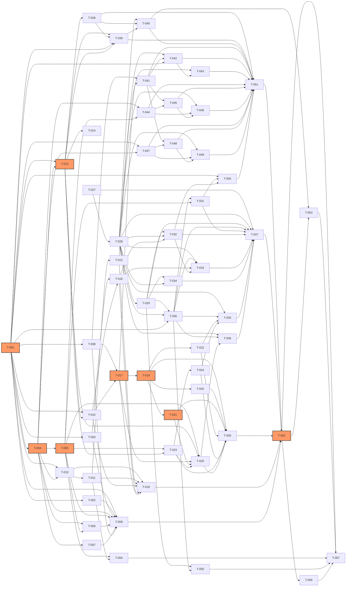

# Development Plan: Keel

[NAV]
- §1 迭代规划 → Sprint 1~6 总览表
- §2 依赖图 → Mermaid DAG + 关键路径
- §3 任务卡详细 → T-001~T-057 索引总表（完整卡片见各分卷）
  - Sprint 1 (T-001~T-009): [dev-plan-keel-s1](dev-plan-keel-s1.md)
  - Sprint 2 (T-010~T-018): [dev-plan-keel-s2](dev-plan-keel-s2.md)
  - Sprint 3 (T-019~T-026): [dev-plan-keel-s3](dev-plan-keel-s3.md)
  - Sprint 4 (T-027~T-037): [dev-plan-keel-s4](dev-plan-keel-s4.md)
  - Sprint 5 (T-038~T-051): [dev-plan-keel-s5](dev-plan-keel-s5.md)
  - Sprint 6 (T-052~T-057): [dev-plan-keel-s6](dev-plan-keel-s6.md)
- §4 关键路径
- §5 风险项
- §6 集成与E2E测试规划
[/NAV]

## 1. 迭代规划

### Sprint 1: 蓝图核心 + 门禁骨架（基础设施）

| 任务ID | 任务名 | 模块 | 依赖 | TDD测试点 | 状态 |
|--------|--------|------|------|-----------|------|
| T-001 | 蓝图 schema 与 IR 核心 | M-001 | — | AC-001,AC-002,AC-003 | todo |
| T-002 | 蓝图加载/序列化/持久化 | M-001 | T-001 | AC-001,AC-002,AC-003 | todo |
| T-003 | 蓝图查询与 blast radius 基础 | M-001 | T-001 | AC-001,AC-002,AC-003 | todo |
| T-004 | 门禁引擎骨架与检查器 adapter | M-002 | T-001 | AC-001,AC-002,AC-003 | todo |
| T-005 | 门禁两阶段执行与结构化输出 | M-002 | T-004 | AC-001,AC-002,AC-003 | todo |
| T-006 | 回归守护（RegressionGuard）| M-002 | T-004,T-005 | AC-001,AC-002,AC-003 | todo |
| T-007 | Escape Hatch 豁免逻辑 | M-002 | T-004 | AC-001,AC-002 | todo |
| T-008 | 元数据 SQLite schema + E-001~E-006 | — | — | AC-001,AC-002 | todo |
| T-009 | [VALIDATION] 蓝图核心与门禁骨架 | M-001,M-002 | T-001~T-008 | — | todo |

### Sprint 2: 漂移检测 + 意图捕获 + 执行引擎接缝

| 任务ID | 任务名 | 模块 | 依赖 | TDD测试点 | 状态 |
|--------|--------|------|------|-----------|------|
| T-010 | AST 逆向提取（AstExtractor）| M-003 | T-001,T-004 | AC-001,AC-002,AC-003 | todo |
| T-011 | 蓝图对账与漂移分类 | M-003 | T-010 | AC-001,AC-002,AC-003 | todo |
| T-012 | ChangeWatcher 通道外改动发现 | M-003 | T-011 | AC-001,AC-002 | todo |
| T-013 | 执行引擎抽象层（ACP/SDK/CLI adapter）| M-008 | T-001,T-004 | AC-001,AC-002,AC-003 | todo |
| T-014 | 工具面（MCP Server / hooks / CLI）| M-008 | T-013 | AC-001,AC-002 | todo |
| T-015 | 意图翻译器（IntentTranslator + LLM 调用）| M-005 | T-001,T-013 | AC-001,AC-002,AC-003 | todo |
| T-016 | 蓝图 diff + 通俗说明 + blast radius | M-005 | T-003,T-015 | AC-001,AC-002,AC-003 | todo |
| T-017 | 契约冻结门（FrozenContractSet + E-004）| M-005 | T-008,T-015 | AC-001,AC-002,AC-003 | todo |
| T-018 | [VALIDATION] 漂移检测 + 意图捕获核心流程 | M-003,M-005 | T-010~T-017 | — | todo |

### Sprint 3: 实现执行 + 自愈 + 调和

| 任务ID | 任务名 | 模块 | 依赖 | TDD测试点 | 状态 |
|--------|--------|------|------|-----------|------|
| T-019 | DAG 调度器（DagScheduler）| M-006 | T-001,T-005,T-017 | AC-001,AC-002,AC-003 | todo |
| T-020 | 精准上下文注入（ContextInjector）| M-006 | T-019 | AC-001,AC-002 | todo |
| T-021 | Worktree 隔离与回滚（WorktreeIsolator）| M-006 | T-019 | AC-001,AC-002,AC-003 | todo |
| T-022 | 实现进度状态机（ProgressStateMachine）| M-006 | T-019 | AC-001,AC-002 | todo |
| T-023 | 自愈层错误分类与重试（M-007 核心）| M-007 | T-005,T-013 | AC-001,AC-002,AC-003 | todo |
| T-024 | 自愈上浮与「需你决策」卡片 | M-007 | T-023 | AC-001,AC-002 | todo |
| T-025 | 调和引擎（切片重生成 + 内容保护）| M-004 | T-005,T-013,T-017,T-021,T-023 | AC-001,AC-002,AC-003 | todo |
| T-026 | [VALIDATION] 实现执行 + 自愈 + 调和端到端流程 | M-004,M-006,M-007 | T-019~T-025 | — | todo |

### Sprint 4: 工作区前端 + 能力地图 + 对话面

| 任务ID | 任务名 | 模块 | 依赖 | TDD测试点 | 状态 |
|--------|--------|------|------|-----------|------|
| T-027 | 设计 token 与主题系统（THEME-01）| M-015 | — | AC-001,AC-002 | todo |
| T-028 | 基础原子组件（UC-001/UC-004/UC-013/UC-015/UC-018）| M-015 | T-027 | AC-001,AC-002,AC-003 | todo |
| T-029 | 三面工作区外壳（P-001，M-015）| M-015 | T-027,T-028 | AC-001,AC-002,AC-003 | todo |
| T-030 | 能力地图渲染面（React Flow，P-002，M-009）| M-009 | T-028,T-029,T-001 | AC-001,AC-002,AC-003 | todo |
| T-031 | 健康叠加 + 节点 status（M-009 HealthOverlay）| M-009 | T-030,T-005 | AC-001,AC-002,AC-003 | todo |
| T-032 | 对话面 + 意图输入（P-003 对话侧，M-005）| M-005,M-015 | T-028,T-029,T-016 | AC-001,AC-002,AC-003 | todo |
| T-033 | 蓝图 diff 卡与 blast radius 展示（P-003 diff 侧）| M-005,M-009 | T-030,T-032 | AC-001,AC-002,AC-003 | todo |
| T-034 | 应用预览面（P-004，M-010）| M-010 | T-028,T-029 | AC-001,AC-002,AC-003 | todo |
| T-035 | 实现进度叠加 + 「需你决策」卡（P-005）| M-006,M-007 | T-028,T-030,T-022,T-024 | AC-001,AC-002,AC-003 | todo |
| T-036 | 健康调和抽屉（P-006，M-002~M-004,M-007）| M-002,M-003,M-004 | T-028,T-030,T-025 | AC-001,AC-002,AC-003 | todo |
| T-037 | [VALIDATION] 工作区前端核心三面 + 意图→diff→确认流程 | M-009,M-015 | T-027~T-036 | — | todo |

### Sprint 5: 生命周期功能（上手 + 时光机 + 上线 + 导出）

| 任务ID | 任务名 | 模块 | 依赖 | TDD测试点 | 状态 |
|--------|--------|------|------|-----------|------|
| T-038 | 项目初始化：引擎检测与安装引导（M-014）| M-014 | T-013 | AC-001,AC-002,AC-003 | todo |
| T-039 | 项目初始化：鉴权 + 骨架生成（M-014）| M-014 | T-038,T-001,T-013 | AC-001,AC-002,AC-003 | todo |
| T-040 | 上手向导页面（P-007，M-014+M-008）| M-014 | T-028,T-038,T-039 | AC-001,AC-002,AC-003 | todo |
| T-041 | 意图日志存储（M-011，E-002/E-003）| M-011 | T-008,T-017 | AC-001,AC-002,AC-003 | todo |
| T-042 | 时间线视图与时光机回滚（M-011）| M-011 | T-041,T-001,T-012 | AC-001,AC-002,AC-003 | todo |
| T-043 | 时光机页面（P-008，M-011）| M-011 | T-028,T-042 | AC-001,AC-002,AC-003 | todo |
| T-044 | 安全体检三类检查器（M-012 SecurityAuditor）| M-012 | T-004,T-005 | AC-001,AC-002,AC-003 | todo |
| T-045 | 一键上线部署驱动（M-012 DeployDriver）| M-012 | T-044,T-041 | AC-001,AC-002 | todo |
| T-046 | 上线+安全体检页面（P-009，M-012）| M-012 | T-028,T-044,T-045 | AC-001,AC-002,AC-003 | todo |
| T-047 | 代码仓导出与工具配置编译（M-013）| M-013 | T-001,T-004 | AC-001,AC-002,AC-003 | todo |
| T-048 | 交接包生成（M-013 HandoffPackager）| M-013 | T-047,T-041 | AC-001,AC-002,AC-003 | todo |
| T-049 | 导出交接页面（P-010，M-013）| M-013 | T-028,T-047,T-048 | AC-001,AC-002 | todo |
| T-050 | 自由实现区标注 + 地图展示（P-011，M-001+M-009）| M-001,M-009 | T-001,T-031,T-032 | AC-001,AC-002,AC-003 | todo |
| T-051 | [VALIDATION] 生命周期功能：上手+时光机+上线+导出 | M-011,M-012,M-013,M-014 | T-038~T-050 | — | todo |

### Sprint 6: 集成打通 + 性能调优 + 错误处理完善

| 任务ID | 任务名 | 模块 | 依赖 | TDD测试点 | 状态 |
|--------|--------|------|------|-----------|------|
| T-052 | 全链路接线：意图→diff→冻结→执行→健康 | 全链路 | T-001~T-051 | AC-001,AC-002,AC-003 | todo |
| T-053 | 用量徽标与引擎侧消耗透明（UC-020，M-014）| M-014 | T-040 | AC-001,AC-002 | todo |
| T-054 | 增量检测性能优化（M-002/M-003 ≤3s/≤5s）| M-002,M-003 | T-005,T-011 | AC-001,AC-002 | todo |
| T-055 | 工作区首屏性能优化（≤2s，React Flow 懒加载）| M-015,M-009 | T-029,T-030 | AC-001,AC-002 | todo |
| T-056 | 错误降级 + 通俗化全面审查（F-003 AC-004 / F-008 AC-003）| 全链路 | T-052 | AC-001,AC-002 | todo |
| T-057 | [VALIDATION] 完整产品端到端验收 | 全链路 | T-052~T-056 | — | todo |

## 3. 任务卡详细

> 本章为索引总表，完整任务卡（含 deliverables / tdd_acceptance / context_load）见各 Sprint 分卷。

| 任务ID | 任务名 | task_kind | 所属Sprint | 关联模块 | 分卷 |
|--------|--------|-----------|-----------|---------|------|
| T-001 | 蓝图 Schema 与图 IR 核心 | feature | S1 | M-001 | [s1](dev-plan-keel-s1.md) |
| T-002 | 蓝图加载 / 序列化 / 持久化 | feature | S1 | M-001 | [s1](dev-plan-keel-s1.md) |
| T-003 | 蓝图查询与 Blast Radius 基础 | feature | S1 | M-001 | [s1](dev-plan-keel-s1.md) |
| T-004 | 门禁引擎骨架与检查器 Adapter | feature | S1 | M-002 | [s1](dev-plan-keel-s1.md) |
| T-005 | 门禁两阶段执行与结构化输出 | feature | S1 | M-002 | [s1](dev-plan-keel-s1.md) |
| T-006 | 回归守护（RegressionGuard）| feature | S1 | M-002 | [s1](dev-plan-keel-s1.md) |
| T-007 | Escape Hatch 豁免逻辑 | feature | S1 | M-002 | [s1](dev-plan-keel-s1.md) |
| T-008 | 元数据 SQLite Schema + E-001~E-006 | chore | S1 | — | [s1](dev-plan-keel-s1.md) |
| T-009 | [VALIDATION] 蓝图核心与门禁骨架 | validation | S1 | M-001,M-002 | [s1](dev-plan-keel-s1.md) |
| T-010 | AST 逆向提取（AstExtractor）| feature | S2 | M-003 | [s2](dev-plan-keel-s2.md) |
| T-011 | 蓝图对账与漂移分类 | feature | S2 | M-003 | [s2](dev-plan-keel-s2.md) |
| T-012 | ChangeWatcher 通道外改动发现 | feature | S2 | M-003 | [s2](dev-plan-keel-s2.md) |
| T-013 | 执行引擎抽象层（ACP/SDK/CLI Adapter）| feature | S2 | M-008 | [s2](dev-plan-keel-s2.md) |
| T-014 | 工具面（MCP Server / hooks / CLI）| feature | S2 | M-008 | [s2](dev-plan-keel-s2.md) |
| T-015 | 意图翻译器（IntentTranslator + LLM 调用）| feature | S2 | M-005 | [s2](dev-plan-keel-s2.md) |
| T-016 | 蓝图 diff + 通俗说明 + blast radius | feature | S2 | M-005 | [s2](dev-plan-keel-s2.md) |
| T-017 | 契约冻结门（FrozenContractSet + E-004）| feature | S2 | M-005 | [s2](dev-plan-keel-s2.md) |
| T-018 | [VALIDATION] 漂移检测 + 意图捕获核心流程 | validation | S2 | M-003,M-005,M-008 | [s2](dev-plan-keel-s2.md) |
| T-019 | DAG 调度器（DagScheduler）| feature | S3 | M-006 | [s3](dev-plan-keel-s3.md) |
| T-020 | 精准上下文注入（ContextInjector）| feature | S3 | M-006 | [s3](dev-plan-keel-s3.md) |
| T-021 | Worktree 隔离与回滚（WorktreeIsolator）| feature | S3 | M-006 | [s3](dev-plan-keel-s3.md) |
| T-022 | 实现进度状态机（ProgressStateMachine）| feature | S3 | M-006 | [s3](dev-plan-keel-s3.md) |
| T-023 | 自愈层错误分类与重试（M-007 核心）| feature | S3 | M-007 | [s3](dev-plan-keel-s3.md) |
| T-024 | 自愈上浮与「需你决策」卡片 | feature | S3 | M-007 | [s3](dev-plan-keel-s3.md) |
| T-025 | 调和引擎（切片重生成 + 内容保护）| feature | S3 | M-004 | [s3](dev-plan-keel-s3.md) |
| T-026 | [VALIDATION] 实现执行 + 自愈 + 调和端到端流程 | validation | S3 | M-004,M-006,M-007 | [s3](dev-plan-keel-s3.md) |
| T-027 | 设计 Token 与主题系统（THEME-01）| chore | S4 | M-015 | [s4](dev-plan-keel-s4.md) |
| T-028 | 基础原子组件（UC-001/UC-004/UC-013/UC-015/UC-018）| feature | S4 | M-015 | [s4](dev-plan-keel-s4.md) |
| T-029 | 三面工作区外壳（P-001，M-015）| feature | S4 | M-015 | [s4](dev-plan-keel-s4.md) |
| T-030 | 能力地图渲染面（React Flow，P-002，M-009）| feature | S4 | M-009 | [s4](dev-plan-keel-s4.md) |
| T-031 | 健康叠加 + 节点 Status（M-009 HealthOverlay）| feature | S4 | M-009 | [s4](dev-plan-keel-s4.md) |
| T-032 | 对话面 + 意图输入（P-003 对话侧，M-005）| feature | S4 | M-005,M-015 | [s4](dev-plan-keel-s4.md) |
| T-033 | 蓝图 Diff 卡与 Blast Radius 展示（P-003 diff 侧）| feature | S4 | M-005,M-009 | [s4](dev-plan-keel-s4.md) |
| T-034 | 应用预览面（P-004，M-010）| feature | S4 | M-010 | [s4](dev-plan-keel-s4.md) |
| T-035 | 实现进度叠加 + 「需你决策」卡（P-005）| feature | S4 | M-006,M-007 | [s4](dev-plan-keel-s4.md) |
| T-036 | 健康调和抽屉（P-006）| feature | S4 | M-002,M-003,M-004 | [s4](dev-plan-keel-s4.md) |
| T-037 | [VALIDATION] 工作区前端核心三面 + 意图→diff→确认流程 | validation | S4 | M-009,M-015 | [s4](dev-plan-keel-s4.md) |
| T-038 | 项目初始化：引擎检测与安装引导（M-014）| feature | S5 | M-014 | [s5](dev-plan-keel-s5.md) |
| T-039 | 项目初始化：鉴权 + 骨架生成（M-014）| feature | S5 | M-014 | [s5](dev-plan-keel-s5.md) |
| T-040 | 上手向导页面（P-007，M-014+M-008）| feature | S5 | M-014 | [s5](dev-plan-keel-s5.md) |
| T-041 | 意图日志存储（M-011，E-002/E-003）| feature | S5 | M-011 | [s5](dev-plan-keel-s5.md) |
| T-042 | 时间线视图与时光机回滚（M-011）| feature | S5 | M-011 | [s5](dev-plan-keel-s5.md) |
| T-043 | 时光机页面（P-008，M-011）| feature | S5 | M-011 | [s5](dev-plan-keel-s5.md) |
| T-044 | 安全体检三类检查器（M-012 SecurityAuditor）| feature | S5 | M-012 | [s5](dev-plan-keel-s5.md) |
| T-045 | 一键上线部署驱动（M-012 DeployDriver）| feature | S5 | M-012 | [s5](dev-plan-keel-s5.md) |
| T-046 | 上线+安全体检页面（P-009，M-012）| feature | S5 | M-012 | [s5](dev-plan-keel-s5.md) |
| T-047 | 代码仓导出与工具配置编译（M-013）| feature | S5 | M-013 | [s5](dev-plan-keel-s5.md) |
| T-048 | 交接包生成（M-013 HandoffPackager）| feature | S5 | M-013 | [s5](dev-plan-keel-s5.md) |
| T-049 | 导出交接页面（P-010，M-013）| feature | S5 | M-013 | [s5](dev-plan-keel-s5.md) |
| T-050 | 自由实现区标注 + 地图展示（P-011，M-001+M-009）| feature | S5 | M-001,M-009 | [s5](dev-plan-keel-s5.md) |
| T-051 | [VALIDATION] 生命周期功能：上手+时光机+上线+导出 | validation | S5 | M-011,M-012,M-013,M-014 | [s5](dev-plan-keel-s5.md) |
| T-052 | 全链路接线：意图→diff→冻结→执行→健康 | feature | S6 | 全链路 | [s6](dev-plan-keel-s6.md) |
| T-053 | 用量徽标与引擎侧消耗透明（UC-020，M-014）| feature | S6 | M-014 | [s6](dev-plan-keel-s6.md) |
| T-054 | 增量检测性能优化（M-002/M-003 ≤3s/≤5s）| fix | S6 | M-002,M-003 | [s6](dev-plan-keel-s6.md) |
| T-055 | 工作区首屏性能优化（≤2s，React Flow 懒加载）| fix | S6 | M-015,M-009 | [s6](dev-plan-keel-s6.md) |
| T-056 | 错误降级 + 通俗化全面审查 | fix | S6 | 全链路 | [s6](dev-plan-keel-s6.md) |
| T-057 | [VALIDATION] 完整产品端到端验收 | validation | S6 | 全链路 | [s6](dev-plan-keel-s6.md) |

## 2. 依赖图

## 4. 关键路径

关键路径（权重最长链，按 S=1/M=2/L=3 计）：

**主链路**：T-001(L) → T-004(L) → T-005(M) → T-017(M) → T-019(M) → T-021(M) → T-025(L) → T-026(validation) → T-052(L) → T-057(validation)

**关键节点说明**：
- **T-001**（蓝图 schema + IR）：所有下游依赖的最底层，零可绕过
- **T-004**（门禁骨架）：12 个下游任务的前置，延误直接影响 Sprint 2~4
- **T-013**（执行引擎抽象层）：意图执行、调和、初始化的统一接缝
- **T-017**（契约冻结）：实现阶段进入的门
- **T-021**（Worktree 隔离）：实现隔离（F-010 AC-004）核心机制
- **T-052**（全链路接线）：六个 Sprint 产出汇合点

**并行度**：
- Sprint 1：T-001/T-008 可并行；T-004 与 T-008 无依赖关系，并行
- Sprint 2：T-010~T-012（漂移）与 T-015~T-017（意图）可并行
- Sprint 4：T-027 设计 token → T-028 原子组件 → 各业务组件可以 fan-out 并行
- Sprint 5：T-038~T-040（初始化）/ T-041~T-043（时光机）/ T-044~T-046（上线）/ T-047~T-049（导出）可 4 路并行

## 5. 风险项

| 风险 | 影响 | 缓解措施 |
|------|------|----------|
| React Flow v12 bundle size 超 2s 预算（P-002 [ASSUMPTION]）| F-008 AC-005 首屏性能 | dev 阶段 profiling；提前在 T-030 验证懒加载效果；备选 D3 自绘路径 |
| ACP 协议字段映射细节未完全确定（API-009 [ASSUMPTION]）| T-013 / T-015 实现范围 | T-013 先交付 adapter 接口骨架 + SDK/CLI 两种实现；ACP 字段补丁在 T-052 接线阶段 |
| PortSignature 精细化格式（API-009 [ASSUMPTION]）| T-020 ContextInjector 实现 | T-017 契约冻结阶段做最小 JSON 结构共识；不影响后续任务主体逻辑 |
| ChangeWatcher 发现时机选型（M-003 [ASSUMPTION]）| F-002 AC-006 来源无关语义完整性 | T-012 先实现「打开扫描」路径满足 AC-006，实时监听作为增量优化 |
| SQLite local-first 与 Web 壳跨进程访问（E-001~E-006）| T-008 持久化层设计 | T-008 明确本地引擎服务为数据库宿主，Web 壳经本地引擎 HTTP API 间接访问；不直连 SQLite |
| IntentTranslator LLM 结构化生成 ≤10s（F-009 AC-008）| 用户体验 | T-015 注入最小上下文（选中节点 + 一跳邻域），约束 prompt token；arch §5.1 已设计 |
| 意图日志 git commit↔entry 映射粒度（E-002 gitRef [ASSUMPTION]）| M-011 持久化方案 | T-041 先用 entryId 本地存储确保可用；git 映射作为可选字段，不阻塞功能 |

## 6. 集成与E2E测试规划

| Sprint | 测试类型 | 覆盖场景 | 依赖任务 | 测试范围描述 |
|--------|----------|----------|----------|-------------|
| Sprint 1 | Integration | M-001 蓝图加载 → M-002 门禁执行 → GateReport JSON | T-001~T-007 | blueprint.example.yaml 加载后制造四类违规验证 GateReport 结构正确；escape hatch 豁免验证 |
| Sprint 1 | Integration | blueprint.schema.json 形态校验 + 七原语 + plain 必填 | T-001,T-002 | AC-001/AC-002/AC-007 全量 schema 校验 |
| Sprint 2 | Integration | M-003 AST 逆向 → DriftReport vs 蓝图期望态对账 | T-010,T-011 | 制造四类漂移（通道内外），验证 DriftReport 覆盖 AC-002 四类 |
| Sprint 2 | Integration | M-005 意图 → BlueprintDiff → blast radius 计算 | T-015,T-016,T-003 | 注入意图文本验证产出 diff + blast radius；≤10s 性能 |
| Sprint 2 | Integration | API-006 契约冻结 → FrozenContractSet 持久化 | T-017,T-008 | 冻结后字段不可变；不完整退回澄清 |
| Sprint 3 | Integration | M-006 DAG 调度 → WorktreeIsolator 回滚 → GateReport | T-019,T-021,T-005 | 失败切片回滚到改动前态；已就绪切片不受影响 |
| Sprint 3 | Integration | M-007 自愈 → 3 次重试 → 「需你决策」卡升级 | T-023,T-024 | 同一错误 ≤3 次计数；第 4 次输出 DecisionCard |
| Sprint 3 | Integration | M-004 调和 → escape hatch 内容保护提示 → 门禁通过 | T-025,T-007 | 切片含 escape hatch 时产出 protectedContentPrompt；调和后 DriftReport 清除该项 |
| Sprint 4 | E2E | 用户意图输入 → 对话面 diff 卡展示 → 确认 → 节点进入 implementing/ready | T-032,T-033,T-035,T-030 | P-003 → P-005 全流程用户场景；20 节点地图渲染 ≤1s |
| Sprint 4 | E2E | 健康 red 节点可点 → 健康调和抽屉 → 一键修复 → 节点转绿 | T-031,T-036,T-025 | P-006 调和完整流程；P-002 健康叠加同步刷新 |
| Sprint 4 | Integration | 三面工作区首屏 ≤2s（React Flow 懒加载验证）| T-029,T-030,T-034 | lighthouse / performance.now() 测量三面初次挂载时间 |
| Sprint 5 | E2E | 新项目上手：引擎检测 → 登录 → 描述意图 → 生成骨架 → 进工作区 | T-038~T-040,T-030 | P-007 全向导；全程无终端命令出现 |
| Sprint 5 | E2E | 时光机：添加功能 → 记录日志 → 回滚到上一点 → 状态一致 | T-041~T-043 | P-008 回滚后蓝图+代码+健康灯三态一致 |
| Sprint 5 | E2E | 一键上线：安全体检 → 红灯阻断 → 修复 → 全绿 → 部署 → 返回地址 | T-044~T-046 | P-009 含 has-red 场景阻断验证 |
| Sprint 5 | Integration | 导出仓库 → 无 Keel 环境运行 dependency-cruiser/eslint | T-047 | F-015 AC-002/AC-003：导出物自带工具配置可独立强制结构 |
| Sprint 6 | E2E | 完整产品：新建应用 → 加两个能力 → 健康调和 → 时光机回滚 → 导出 | T-052 | 端到端覆盖 F-001~F-018 全功能；NFR 回归测试 |
| Sprint 6 | Integration | 切换执行引擎（ACP ↔ SDK）→ 蓝图/门禁/地图结果一致 | T-013,T-052 | F-018 AC-004 透明切换验证 |
| Sprint 6 | Integration | 通道外改动 → ChangeWatcher 发现 → DriftReport → 调和清除 | T-012,T-052 | F-002 AC-006 来源无关语义全链路 |
